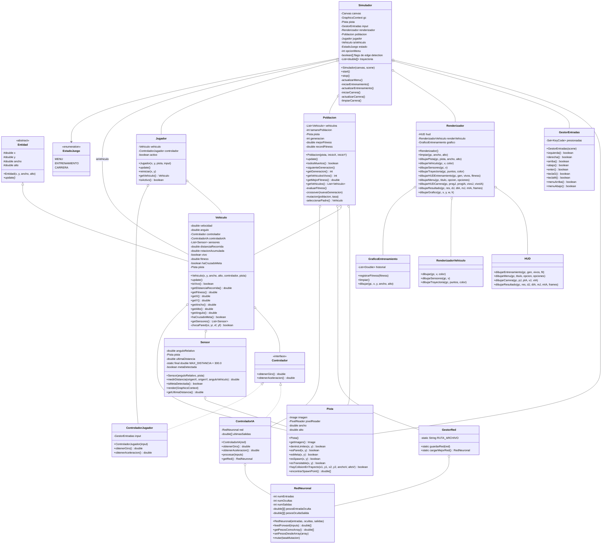
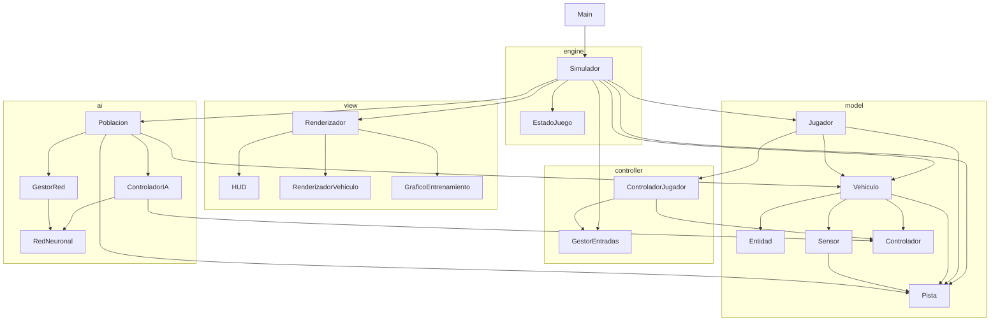

# Diagrama de Clases

## Mermaid UML

```mermaid
classDiagram
    class Entidad {
        <<abstract>>
        #double x
        #double y
        #double ancho
        #double alto
        +Entidad(x, y, ancho, alto)
        +update()*
    }

    class Controlador {
        <<interface>>
        +obtenerGiro() double
        +obtenerAceleracion() double
    }

    class Vehiculo {
        -double velocidad
        -double angulo
        -Controlador controlador
        -ControladorIA controladorIA
        -List~Sensor~ sensores
        -double distanciaRecorrida
        -double rotacionAcumulada
        -boolean vivo
        -double fitness
        -boolean haCruzadoMeta
        -Pista pista
        +Vehiculo(x, y, ancho, alto, controlador, pista)
        +update()
        +isVivo() boolean
        +getDistanciaRecorrida() double
        +getFitness() double
        +getX() double
        +getY() double
        +getAncho() double
        +getAlto() double
        +getAngulo() double
        +haCruzadoMeta() boolean
        +getSensores() List~Sensor~
        -chocaPared(xi, yi, xf, yf) boolean
    }

    class Sensor {
        -double anguloRelativo
        -Pista pista
        -double ultimaDistancia
        -static final double MAX_DISTANCIA = 300.0
        -boolean metaDetectada
        +Sensor(anguloRelativo, pista)
        +medirDistancia(origenX, origenY, anguloVehiculo) double
        +isMetaDetectada() boolean
        +render(GraphicsContext)
        +getUltimaDistancia() double
    }

    class Pista {
        -Image imagen
        -PixelReader pixelReader
        -double ancho
        -double alto
        +Pista()
        +getImagen() Image
        +dentroLimites(x, y) boolean
        +esPared(x, y) boolean
        +esMeta(x, y) boolean
        +esSpawn(x, y) boolean
        +esTransitable(x, y) boolean
        +hayColisionEnTrayecto(x1, y1, x2, y2, anchoV, altoV) boolean
        +encontrarSpawnPoint() double[]
    }

    class Jugador {
        -Vehiculo vehiculo
        -ControladorJugador controlador
        -boolean activo
        +Jugador(x, y, pista, input)
        +update()
        +reiniciar(x, y)
        +getVehiculo() Vehiculo
        +isActivo() boolean
    }

    class ControladorIA {
        -RedNeuronal red
        -double[] ultimasSalidas
        +ControladorIA(red)
        +obtenerGiro() double
        +obtenerAceleracion() double
        +procesar(inputs)
        +getRed() RedNeuronal
    }

    class ControladorJugador {
        -GestorEntradas input
        +ControladorJugador(input)
        +obtenerGiro() double
        +obtenerAceleracion() double
    }

    class GestorEntradas {
        -Set~KeyCode~ presionadas
        +GestorEntradas(scene)
        +izquierda() boolean
        +derecha() boolean
        +arriba() boolean
        +abajo() boolean
        +enter() boolean
        +teclaG() boolean
        +teclaM() boolean
        +menuArriba() boolean
        +menuAbajo() boolean
    }

    class RedNeuronal {
        -int numEntradas
        -int numOcultas
        -int numSalidas
        -double[][] pesosEntradaOculta
        -double[][] pesosOcultaSalida
        +RedNeuronal(entradas, ocultas, salidas)
        +feedForward(inputs) double[]
        +getPesosComoArray() double[]
        +setPesosDesdeArray(array)
        +mutar(tasaMutacion)
    }

    class Poblacion {
        -List~Vehiculo~ vehiculos
        -int tamanoPoblacion
        -Pista pista
        -int generacion
        -double mejorFitness
        -double recordFitness
        +Poblacion(pista, inicioX, inicioY)
        +update()
        +todosMuertos() boolean
        +siguienteGeneracion()
        +getGeneracion() int
        +getVehiculosVivos() int
        +getMejorFitness() double
        +getVehiculos() List~Vehiculo~
        -evaluarFitness()
        -crossover(nuevaGeneracion)
        -mutacion(poblacion, tasa)
        -seleccionarPadre() Vehiculo
    }

    class GestorRed {
        -static String RUTA_ARCHIVO
        +static guardarRed(red)
        +static cargarMejorRed() RedNeuronal
    }

    class Simulador {
        -Canvas canvas
        -GraphicsContext gc
        -Pista pista
        -GestorEntradas input
        -Renderizador renderizador
        -Poblacion poblacion
        -Jugador jugador
        -Vehiculo iaVehiculo
        -EstadoJuego estado
        -int opcionMenu
        -boolean[] flags de edge detection
        -List~double[]~ trayectoria
        +Simulador(canvas, scene)
        +start()
        +stop()
        -actualizarMenu()
        -iniciarEntrenamiento()
        -actualizarEntrenamiento()
        -iniciarCarrera()
        -actualizarCarrera()
        -limpiarCarrera()
    }

    class EstadoJuego {
        <<enumeration>>
        MENU
        ENTRENAMIENTO
        CARRERA
    }

    class Renderizador {
        -HUD hud
        -RenderizadorVehiculo renderVehiculo
        -GraficoEntrenamiento grafico
        +Renderizador()
        +limpiar(gc, ancho, alto)
        +dibujarPista(gc, pista, ancho, alto)
        +dibujarVehiculo(gc, v, color)
        +dibujarSensores(gc, v)
        +dibujarTrayectoria(gc, puntos, color)
        +dibujarHUDEntrenamiento(gc, gen, vivos, fitness)
        +dibujarMenu(gc, titulo, opcion, opciones)
        +dibujarHUDCarrera(gc, progJ, progIA, vivoJ, vivoIA)
        +dibujarResultado(gc, res, dJ, dIA, mJ, mIA, frames)
        +dibujarGrafico(gc, x, y, w, h)
    }

    class HUD {
        +dibujarEntrenamiento(gc, gen, vivos, fit)
        +dibujarMenu(gc, titulo, opcion, opciones)
        +dibujarCarrera(gc, pJ, pIA, vJ, vIA)
        +dibujarResultado(gc, res, dJ, dIA, mJ, mIA, frames)
    }

    class RenderizadorVehiculo {
        +dibujar(gc, v, color)
        +dibujarSensores(gc, v)
        +dibujarTrayectoria(gc, puntos, color)
    }

    class GraficoEntrenamiento {
        -List~Double~ historial
        +registrarFitness(fitness)
        +limpiar()
        +dibujar(gc, x, y, ancho, alto)
    }

    Entidad <|-- Vehiculo
    Controlador <|.. ControladorIA
    Controlador <|.. ControladorJugador
    Vehiculo o-- Controlador
    Vehiculo o-- Sensor
    Vehiculo o-- Pista
    Jugador o-- Vehiculo
    Jugador o-- ControladorJugador
    Sensor o-- Pista
    Simulador o-- Pista
    Simulador o-- GestorEntradas
    Simulador o-- Renderizador
    Simulador o-- Poblacion
    Simulador o-- Jugador
    Simulador o-- Vehiculo : iaVehiculo
    Simulador --> EstadoJuego
    Poblacion o-- Pista
    Poblacion o-- Vehiculo
    Poblacion o-- GestorRed
    Poblacion o-- ControladorIA
    ControladorIA o-- RedNeuronal
    GestorRed o-- RedNeuronal
    Renderizador o-- HUD
    Renderizador o-- RenderizadorVehiculo
    Renderizador o-- GraficoEntrenamiento
```

## Diagrama de Paquetes

```mermaid
flowchart TD
    Main --> Simulador
    subgraph engine
        Simulador
        EstadoJuego
    end
    subgraph controller
        GestorEntradas
        ControladorJugador
    end
    subgraph view
        Renderizador
        HUD
        RenderizadorVehiculo
        GraficoEntrenamiento
    end
    subgraph model
        Entidad
        Vehiculo
        Sensor
        Pista
        Jugador
        Controlador
    end
    subgraph ai
        RedNeuronal
        ControladorIA
        Poblacion
        GestorRed
    end
    Simulador --> GestorEntradas
    Simulador --> Renderizador
    Simulador --> Pista
    Simulador --> Poblacion
    Simulador --> Jugador
    Simulador --> Vehiculo
    Simulador --> EstadoJuego
    Renderizador --> HUD
    Renderizador --> RenderizadorVehiculo
    Renderizador --> GraficoEntrenamiento
    ControladorJugador --> GestorEntradas
    ControladorJugador --> Controlador
    ControladorIA --> Controlador
    ControladorIA --> RedNeuronal
    Jugador --> ControladorJugador
    Jugador --> Vehiculo
    Jugador --> Pista
    Vehiculo --> Entidad
    Vehiculo --> Controlador
    Vehiculo --> Sensor
    Vehiculo --> Pista
    Sensor --> Pista
    Poblacion --> Vehiculo
    Poblacion --> ControladorIA
    Poblacion --> GestorRed
    Poblacion --> Pista
    GestorRed --> RedNeuronal
```
